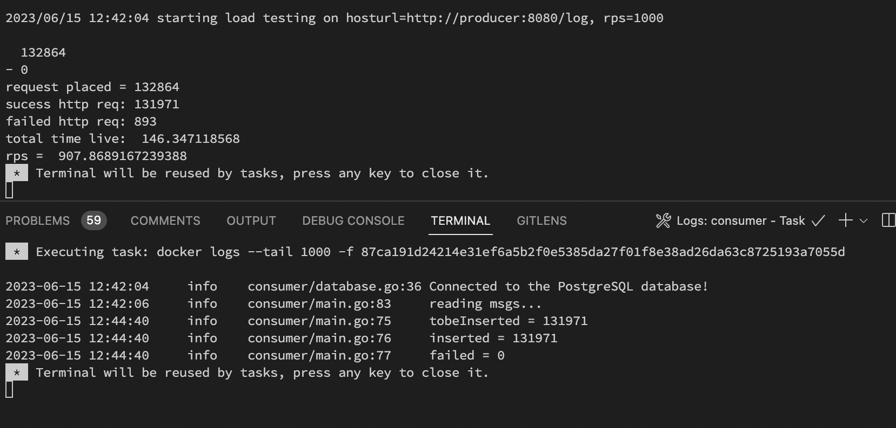
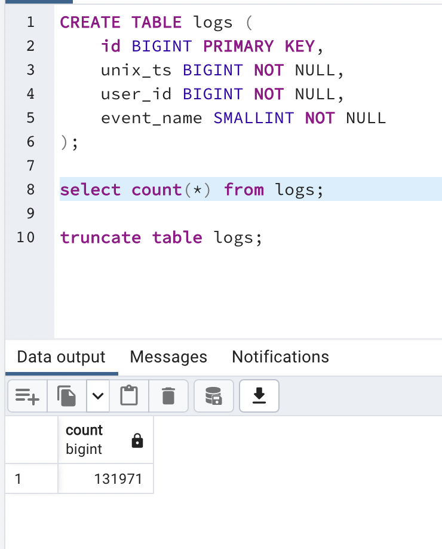

# Readme

## Simple Log Routing service with Golang using Kafka

```go
1. clone the repo into local dir 
2. make up
```

### Results:





### File structure :

```go
.
├── Dockerfile
├── Makefile
├── consumer
│   ├── consumer.json
│   ├── database.go
│   └── main.go
├── docker-compose.yml
├── go.mod
├── go.sum
├── http_tester
│   └── main.go
├── init.sql
├── producer
│   ├── main.go
│   └── producer.json
└── utils
    └── utils.go
```